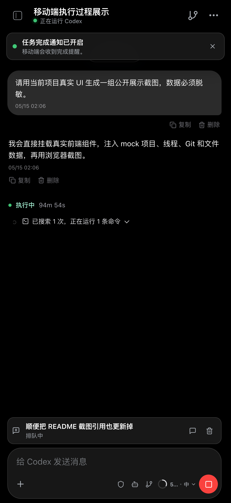
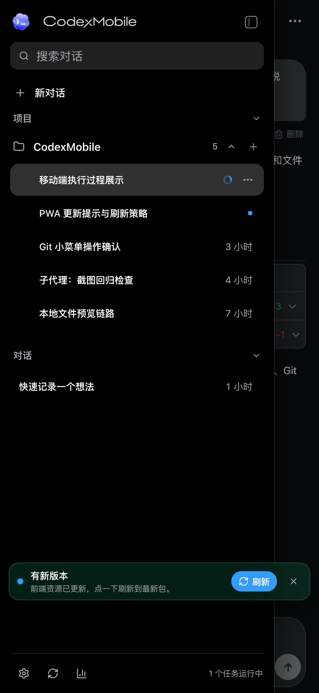
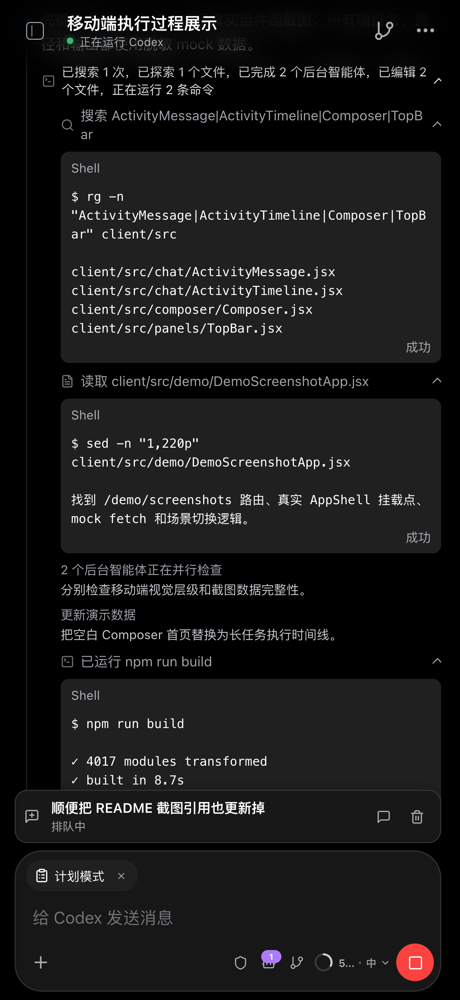
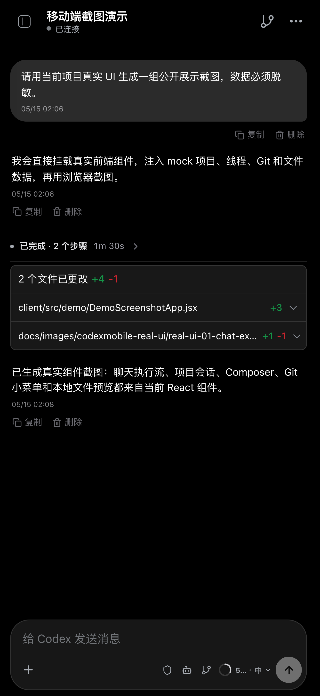
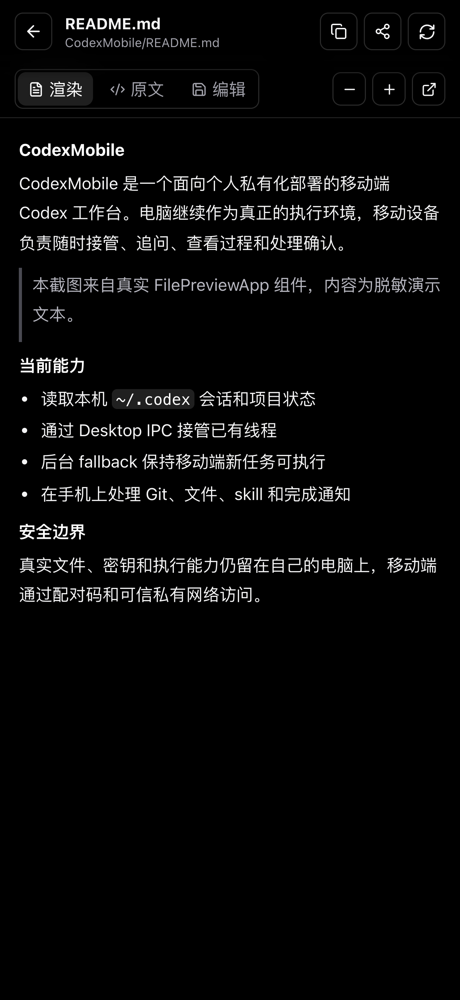
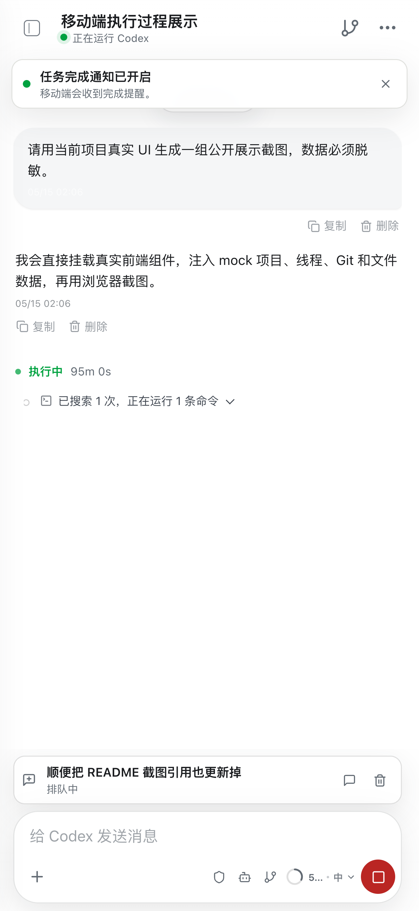
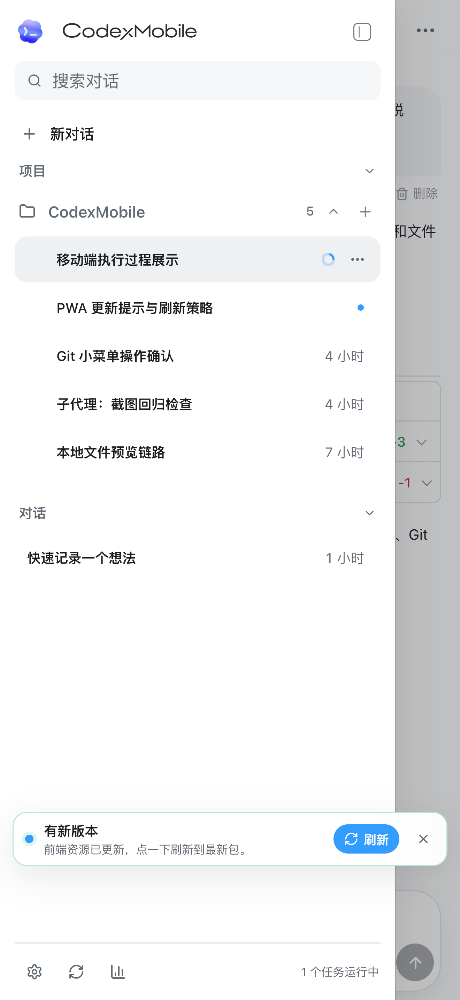
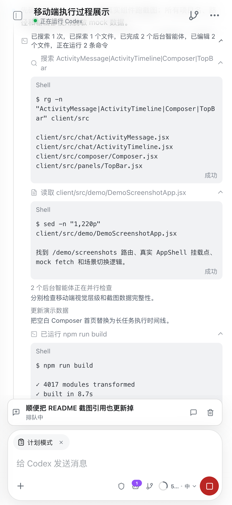
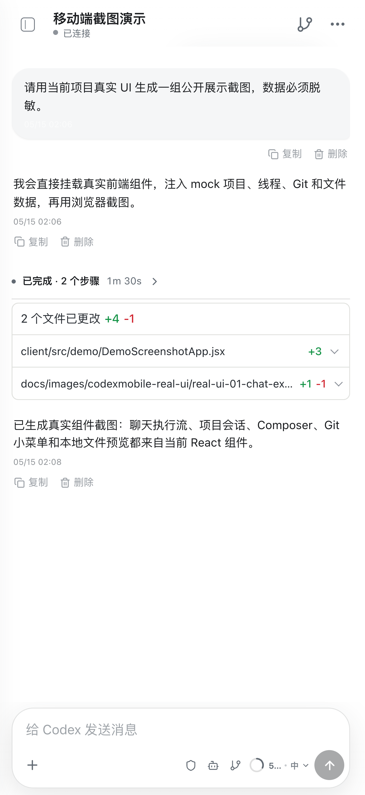
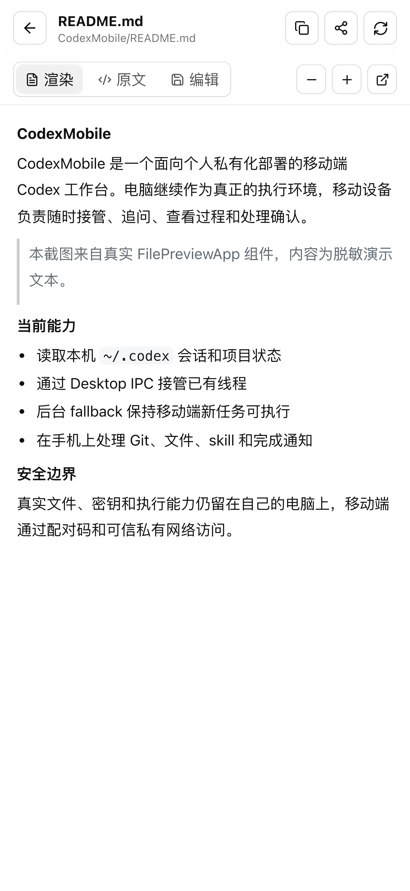

# CodexMobile

CodexMobile 是一个面向个人私有化部署的跨设备 Codex 工作台。电脑继续作为真正的执行环境，iPhone、Android 手机、平板、折叠屏、备用电脑或任何能打开现代浏览器的设备负责随时接管、追问、查看过程、处理确认、接收完成通知。

它不是公网 SaaS，也不是远程桌面，而是把本机 Codex Desktop、`~/.codex` 会话、项目文件、skills、Git 状态和本地工具链，接到一个适合移动端使用的 PWA 里。移动设备通过 Tailscale、局域网或其它可信私有网络访问电脑上的 Node.js 桥接服务，真实文件、密钥和执行能力仍留在个人电脑上。

相比只提供远程聊天入口的移动 Codex 工具，CodexMobile 的核心路线是：完全私有化部署、和桌面端无缝同步、保留完整执行过程，并通过 Tailscale 等私有网络实现外网可用。Codex 的对话、执行、确认和续聊可以随时随地接上，不受 App 平台限制，只要浏览器能打开就能使用。

2.0 版本把这个工作台从“能接上桌面”推进到“能日常管理桌面工作流”：新增移动首页和项目选择、分支选择和 worktree/PR 草稿、归档箱、额度面板、设置页、可信设备管理、终端配对入口、真实 UI 截图和更完整的安全边界。

## 项目定位

移动端 Codex 真正困难的不是“能不能发消息”，而是能不能接上电脑里正在发生的真实工作。

如果移动端只是另起一个聊天窗口，它看起来可以用，但很快就会断层：桌面端的线程不同步，执行过程看不到，任务跑到一半没法追问，文件路径不好输入，Git 状态还要回电脑看，Codex 等待确认时移动端也不知道。

CodexMobile 要解决的是这些具体问题：

- 电脑上开的 Codex 线程，移动端也要能看见和接着用。
- Codex 正在跑的时候，移动端要能 steer、queue、interrupt。
- 执行过程不能丢，完成后可以折叠，但点开必须还在。
- 移动端输入要少一点摩擦，`/` 命令、`@文件`、`$skill` 都应该顺手。
- Git、连接状态、完成通知这些等待电脑的动作，移动端也要能处理。
- 它可以长得轻一点、顺一点，但不能为了好看牺牲过程追踪和桌面同步。

它不是通用聊天 App，而是一个让个人 Codex 工作流在桌面端和移动端之间保持连续的私有移动控制台。

## 平台兼容性

CodexMobile 的核心形态是 Web/PWA，不绑定某个手机系统或应用商店：

- iPhone / iPad：可通过 Safari 访问，也可以添加到主屏作为 PWA 使用。
- Android 手机 / 平板 / 折叠屏：可通过 Chrome、Edge、Firefox 等现代浏览器访问，也可以按浏览器能力安装为 PWA。
- 桌面浏览器 / 备用电脑：只要能访问同一个 Tailscale 或可信私有网络，也可以直接打开使用。
- 平台差异主要在后台通知：iOS Web Push 对 HTTPS、主屏 PWA 和系统版本有额外要求；普通访问、续聊、查看执行过程、Git 小菜单和连接恢复不依赖 iOS。

## 2.0 重点

- **移动首页和项目选择**：移动端不再只能进入最近线程，可以先选项目、查看当前工作区，再进入具体对话。
- **真实 UI 文档**：README 首页截图更新为当前组件渲染出的深色/浅色执行流、侧栏、Composer、Git 小菜单和文件预览。
- **配对和设备安全**：新增 `npm run up` / `npm run pair` 终端配对入口，设置页可以查看、撤销可信设备，并区分当前设备。
- **Git 工作流升级**：Composer 和 Git 面板支持分支读取、搜索、切换、创建分支、创建 worktree，并生成可复制的 PR 草稿。
- **归档、设置和额度面板**：侧栏拆出归档箱、设置页和额度面板，适合移动端反复操作。
- **执行态更稳**：activity card 的标题、合并、折叠、完成态和 live progress 经过重新整理，减少重复卡片和状态残留。
- **安全边界更清楚**：服务端增加请求安全、权限策略、可信代理、公网访问开关和上传/静态资源读取保护。

## 和 Remodex 等项目的区别

CodexMobile 和 Remodex 这类项目都在解决“移动端使用 Codex”的问题，但侧重点不同：

- **完全私有化部署**：服务运行在自己的电脑上，通过配对码、设备 token 和可信私有网络访问，不依赖托管平台。
- **桌面端同步**：直接读取本机 Codex Desktop / `~/.codex` 会话，并通过 Desktop IPC 接管已有线程，尽量保持桌面端和移动端可见性一致。
- **Live mirror 工作流**：移动端不只是发起新对话，还能看到桌面端正在运行、等待确认、后台执行、已完成的真实状态，并继续 steer、queue、interrupt。
- **外网私有访问**：配合 Tailscale 或 Tailscale Serve，可以在外网安全访问家里或办公室电脑上的 CodexMobile，同时保留本机文件和执行环境。
- **不受平台限制**：核心形态是 Web/PWA，只要浏览器能打开，就可以在 iPhone、iPad、Android 手机、Android 平板、折叠屏、备用电脑或桌面浏览器中使用。
- **保留完整执行过程**：不是只显示摘要式聊天结果，而是尽量保留 Codex 工具调用、活动流、错误、完成状态和历史上下文。
- **移动端工作流补齐**：内置文件 mention、skill mention、`/` 命令、队列消息、Git 小菜单、完成通知和连接恢复，目标是让移动端真的能接住日常 Codex 工作。

## 界面演示

截图由当前 React 组件直接渲染，使用安全演示内容替换真实历史对话、文件路径和运行日志。

| 深色执行流 | 深色会话侧栏 | 深色 Composer | 深色 Git 小菜单 | 深色文件预览 |
| --- | --- | --- | --- | --- |
|  |  |  |  |  |

| 浅色执行流 | 浅色会话侧栏 | 浅色 Composer | 浅色 Git 小菜单 | 浅色文件预览 |
| --- | --- | --- | --- | --- |
|  |  |  |  |  |

## 核心能力

### 桌面同步和会话接管

- 读取本机 `~/.codex/config.toml`、`~/.codex/sessions` 和当前 Codex 项目。
- 移动首页支持从项目层进入，而不是必须先进入某个历史线程。
- 通过 Codex Desktop IPC 接管已有桌面线程，尽量保持移动端和桌面端线程可见性一致。
- 当桌面线程未激活或 IPC 不可用时，自动走后台 fallback，并通过同一条会话回读结果。
- 移动端可提前看到当前线程状态，例如 `IPC 在线`、`线程待确认`、`后台运行中`。
- 支持项目切换、线程展开、续聊、重命名、归档和删除。
- 支持归档箱视图，集中搜索、查看和取消归档历史对话。
- 支持移动端新建线程，并在可用时同步到桌面侧。
- 支持从移动端终止桌面侧正在执行的任务。
- 刷新页面后保持当前项目和当前线程，避免跳到其它对话。
- 支持自动标题生成，减少移动端线程列表里的无意义标题。

### 移动端 Composer

- 支持权限模式、模型选择、推理强度选择和多 skills 选择。
- 支持模型速度选择，快速模式会把 Codex service tier 传到后端执行链路。
- 支持项目分支选择：查看、搜索、切换当前项目分支，并显示未提交文件数。
- 支持运行中 `steer`、排队 `queue`、中断 `interrupt`。
- 运行中发送的排队消息会显示在 composer 上方，可恢复、删除或转为立即 steer。
- 支持 `/` 命令面板：
  - `/状态` / `/status`
  - `/压缩上下文` / `/compact`
  - `/代码审查` / `/review`
  - `/子代理` / `/subagents`
- 支持 `$skill` 自动补全，选中后作为结构化 skill 附加到下一轮输入，不把 `$token` 泄漏给模型。
- 支持 `@文件` 项目内搜索，自动忽略 `.git`、`node_modules`、`dist`、`.codexmobile` 等目录。
- 支持图片和文件上传，上传内容保存在本机 `.codexmobile`，路径交给 Codex 使用。

### 执行过程和信息流

- WebSocket 实时显示 Codex 回复、活动流、工具执行状态和错误。
- 桌面 IPC 和后台 fallback 使用同一套发送、回读和刷新逻辑，移动端看到的消息流尽量保持一致。
- 移动端 activity 经过合并、去重和轻量化处理，减少命令生命周期噪音。
- activity card 会合并 live runtime 和历史 loaded session 中的重复执行卡。
- 运行中的任务显示更轻量的 live progress，完成后保留可展开的执行细节。
- 运行中和已完成状态会同步到侧边栏，不区分消息来自移动端还是电脑。
- 任务完成后的执行过程默认折叠，避免刷屏。
- 折叠只是视觉层处理，完整执行文字仍保留，点开后可以追溯。
- 本地命令、文件读取、skill 读取等活动使用更接近桌面端的命名和图标。
- 支持子代理线程显示，能看到并行任务的展开和收起状态。
- Markdown 渲染支持 Mermaid、数学公式、表格和 memory citation 折叠卡片。

### Git 工作流

内置 Git 小菜单面向移动端的高频动作：

- 顶栏 Git 小菜单支持 `status`、`diff`、`commit`、`push`、`pull`、`sync`、创建分支。
- Composer 工具栏支持查看、搜索、切换当前项目分支。
- Git 面板支持创建 `codex/` 分支和 linked worktree。
- 支持生成可复制的 GitHub PR 草稿，方便从手机上准备后续发布动作。
- 提交前会读取 `status`，没有可提交改动时直接提示。
- 当前分支、dirty worktree、超大改动量等风险会在确认弹窗或 toast 中提示。
- 操作过程通过轻量弹窗和 toast 返回结果，不再依赖全屏 Git 视图。

### 通知和连接恢复

- 前台 toast：任务完成、任务失败、需要用户输入、Git 进度都会提示。
- Web Push：在平台和浏览器支持的 HTTPS PWA 环境中，可接收后台完成通知。
- 连接恢复卡片：断开、重连、需配对、同步中、桌面端不可用时，会给出重试、同步、重新配对、查看状态等入口。
- 配对使用固定配对码和设备 token，适合单用户私有网络使用。

### 设置和安全管理

- 设置页支持主题、权限模式、设备管理和安全状态查看。
- 可信设备列表会标记当前设备，可撤销旧手机、旧浏览器或异常设备。
- 后端支持 pairing cooldown、失败次数限制、token TTL、可信代理和公开访问模式配置。
- 危险权限模式默认受服务端开关控制，避免移动端误开高风险执行。

### 本机工具能力

- 本地 Codex SDK 发送和续聊。
- OpenAI 兼容接口图片生成，结果保存到 `.codexmobile/generated`。
- 本地 SenseVoice / FunASR 中文语音识别。
- 可选 OpenAI 兼容转写接口。
- 可选 Edge TTS / OpenAI 兼容 TTS。
- 可选 CLIProxyAPI Codex 额度查询。
- 可选飞书 `lark-cli` 集成，用本机授权创建、读取和修改文档、PPT、表格和云空间文件。

## 架构

```text
Mobile browser / PWA
  |
  | HTTPS / WebSocket
  | 推荐 Tailscale Serve；局域网 HTTP 可用，但部分平台不能触发后台通知
  v
CodexMobile Node.js bridge
  |-- Auth: pairing code + trusted device token
  |-- Security policy: request origin, trusted proxy, token TTL, upload/local-file guard
  |-- Codex data: ~/.codex/config.toml, ~/.codex/sessions, local mobile sessions
  |-- Desktop sync: Codex Desktop IPC read / steer / archive integration
  |-- Chat service: send, queue, steer, interrupt, file mentions, selected skills
  |-- Activity stream: merge, dedupe, collapse, live refresh
  |-- Git service: status, diff, branches, checkout, worktree, PR draft, pull, sync, commit, push
  |-- Push service: VAPID keys, subscriptions, Web Push notifications
  |-- Upload/static service: local uploads, generated images, safe local-image serving
  |-- Optional integrations: lark-cli, CLIProxyAPI, ASR, TTS
```

## 环境要求

- Node.js 20+
- npm
- 已配置好的本机 Codex 环境，默认读取 `~/.codex`
- 移动设备和电脑在同一个可信私有网络中，例如 Tailscale 或局域网
- 可选：Tailscale Serve，用于需要安全来源的 PWA 后台通知
- 可选：本地 SenseVoice ASR 服务（`asr-service`），用于语音转写
- 可选：CLIProxyAPI，用于 OpenAI 兼容路由、图片生成或额度查询
- 可选：`lark-cli`，用于飞书文档、PPT、表格和云空间集成

## 快速开始

```powershell
git clone https://github.com/flyyangX/CodexMobile.git
cd CodexMobile
npm install
npm run up
```

电脑本机打开：

```text
http://127.0.0.1:3321
```

移动设备访问：

```text
http://<电脑的私网 IP>:3321
```

`npm run up` 会构建前端、启动或重启本机服务，并在当前终端打印固定配对码和手机访问链接。后续新增手机或重新配对时，直接运行：

```powershell
npm run pair
```

手机端直接打开终端里显示的配对链接，或在配对页手动输入配对码 `110110`，不需要先在手机上请求配对码。配对成功后浏览器会保存可信设备 Cookie，后续不需要每次重新输入。

## PWA、HTTPS 和完成通知

CodexMobile 的核心功能通过浏览器即可使用；如果需要后台 Web Push 完成通知，通常需要 HTTPS 安全来源和 PWA 安装环境。iOS 的限制更严格，需要满足这些条件：

- iOS 16.4+
- HTTPS 安全来源
- Manifest 配置为 PWA
- 从 Safari 添加到主屏幕
- 从主屏图标打开，而不是普通 Safari 标签页
- 用户点击“开启完成通知”并授权

最省事的方式是 Tailscale Serve：

```powershell
tailscale serve --bg 3321
```

启动后使用 Tailscale 输出的 HTTPS 地址：

```text
https://<your-device>.<your-tailnet>.ts.net/
```

如果之前从 `http://<电脑私网 IP>:3321` 添加过主屏 PWA，需要先删除旧图标，再从 HTTPS 地址重新添加。iOS 会把 HTTP 和 HTTPS 当作不同来源，旧 HTTP PWA 不会自动变成可推送通知的安全 PWA。

可以设置公开地址：

```powershell
$env:CODEXMOBILE_PUBLIC_URL="https://<your-device>.<your-tailnet>.ts.net/"
npm run start:env
```

如果使用自己的证书：

```powershell
$env:HTTPS_PFX_PATH="C:\path\to\server.pfx"
$env:HTTPS_PFX_PASSPHRASE="change-me"
$env:HTTPS_ROOT_CA_PATH="C:\path\to\root-ca.cer"
npm run start:env
```

## 配置

复制示例配置：

```powershell
Copy-Item .env.example .env
npm run start:env
```

常用配置项：

- `HOST`：服务监听地址，默认 `0.0.0.0`
- `PORT`：HTTP 端口，默认 `3321`
- `HTTPS_PORT`：HTTPS 端口，默认 `3443`
- `CODEXMOBILE_PUBLIC_URL`：移动设备访问用的公开私网地址
- `CODEXMOBILE_PAIRING_CODE`：固定配对码，默认 `110110`
- `CODEXMOBILE_PAIRING_CODE_TTL_MS`：配对请求有效期，默认 10 分钟
- `CODEXMOBILE_TOKEN_TTL_MS`：可信设备 token 有效期
- `CODEXMOBILE_PUBLIC_ACCESS`：公开访问模式，默认仍按私有网络和配对场景设计
- `CODEXMOBILE_ALLOWED_ORIGINS`：允许访问的前端来源
- `CODEXMOBILE_TRUSTED_PROXY_CIDRS`：可信代理网段，用于 Tailscale Serve 或反代场景
- `CODEXMOBILE_DANGER_FULL_ACCESS`：是否允许移动端选择高风险权限模式
- `CODEX_HOME`：Codex 配置目录，默认 `~/.codex`
- `CODEXMOBILE_HOME`：CodexMobile 本地状态目录，默认 `.codexmobile/state`
- `CODEXMOBILE_PUSH_SUBJECT`：可选 Web Push VAPID subject；默认使用 `CODEXMOBILE_PUBLIC_URL`，再回退到 `mailto:codexmobile@localhost`
- `CODEXMOBILE_FEISHU_APP_ID` / `CODEXMOBILE_FEISHU_APP_SECRET`：可选飞书应用凭证，用于 `lark-cli` 文档集成
- `LARK_APP_ID` / `LARK_APP_SECRET`：可选飞书凭证别名，供 `lark-cli` 和 Codex 子进程读取
- `CLIPROXYAPI_CONFIG`：CLIProxyAPI 配置文件路径
- `CLIPROXYAPI_API_KEY` / `CLI_PROXY_API_KEY`：OpenAI 兼容接口密钥
- `CODEXMOBILE_CLIPROXY_MANAGEMENT_URL`：CLIProxyAPI 管理接口地址
- `CODEXMOBILE_CLIPROXY_MANAGEMENT_KEY`：CLIProxyAPI 管理密钥

不要提交 `.env`、`.codexmobile`、证书、日志、上传文件、生成图片或本地认证数据。

## 常用脚本

- `npm run build`：构建 PWA 到 `client/dist`
- `npm run up`：构建前端、启动或重启本机服务，并在终端输出配对入口
- `npm run pair`：向本机服务申请配对请求，在终端输出固定配对码和手机链接
- `npm start`：启动 API、WebSocket 和构建后的 PWA
- `npm run start:env`：读取 `.env` 后启动
- `npm run start:bg`：后台启动服务，日志写入 `.codexmobile`
- `npm run mac:autostart`：安装 macOS 用户级 LaunchAgent，开机后保持本地桥接服务运行
- `npm run mac:autostart:remove`：移除 macOS LaunchAgent
- `npm run smoke`：检查本机 `/api/status`

## 开发和测试

开发时可以分别启动前后端：

```powershell
npm run dev:server
npm run dev:client
```

常用验证：

```powershell
node --test client/src/**/*.test.mjs server/**/*.test.mjs server/**/*.test.js shared/**/*.test.mjs
npm run build
```

测试覆盖的重点包括：

- activity 合并、去重、折叠和滚动跟随
- composer `/`、`@文件`、`$skill` token 解析
- queue add/list/delete/restore/steer
- Desktop IPC 能力判断和发送路径
- Git status/diff/pull/sync/commit-push
- Git 分支读取、切换、worktree 和 PR 草稿
- Web Push subscription 和通知 payload
- 文件搜索、上传、本地静态资源安全读取
- 配对、可信设备、权限策略、请求安全和本地文件访问保护
- 自动标题、额度查询、会话列表和归档同步

## API 概览

主要路由从 `server/index.js` 挂载，具体实现已拆到 `server/*-routes.js`、`server/*-service.js` 等模块：

- `GET /api/status`
- `POST /api/pair/request`
- `POST /api/pair/terminal-request`（仅本机 CLI 使用）
- `POST /api/pair`
- `GET /api/devices`
- `POST /api/logout`
- `POST /api/devices/:deviceId/revoke`
- `DELETE /api/devices/:deviceId`
- `POST /api/runtime-debug`
- `POST /api/desktop-refresh`
- `POST /api/desktop-handoff`
- `POST /api/model-settings`
- `POST /api/sync`
- `GET /api/projects`
- `GET /api/sessions/archived`
- `POST /api/sessions/:sessionId/unarchive`
- `GET /api/projects/:projectId/sessions`
- `PATCH /api/projects/:projectId/sessions/:sessionId`
- `DELETE /api/projects/:projectId/sessions/:sessionId`
- `GET /api/sessions/:sessionId/messages`
- `DELETE /api/sessions/:sessionId/messages/:messageId`
- `GET /api/chat/turns/:turnId`
- `POST /api/chat/send`
- `POST /api/chat/compact`
- `POST /api/chat/abort`
- `GET /api/chat/queue`
- `DELETE /api/chat/queue`
- `POST /api/chat/queue/restore`
- `POST /api/chat/queue/steer`
- `GET /api/files/search`
- `POST /api/uploads`
- `GET /api/git/status`
- `GET /api/git/diff`
- `GET /api/git/branches`
- `POST /api/git/checkout`
- `POST /api/git/branch`
- `POST /api/git/worktree`
- `POST /api/git/pr-draft`
- `POST /api/git/commit`
- `POST /api/git/push`
- `POST /api/git/pull`
- `POST /api/git/sync`
- `POST /api/git/commit-push`
- `GET /api/notifications/public-key`
- `POST /api/notifications/subscribe`
- `POST /api/notifications/unsubscribe`
- `GET /api/quotas/codex`
- `POST /api/voice/transcribe`
- `POST /api/voice/speech`
- `GET /api/feishu/status`

## 私有网络部署建议

推荐方式：

1. 电脑和移动设备都安装 Tailscale。
2. 电脑启动 CodexMobile。
3. 日常聊天可使用 Tailscale IP 或局域网 IP。
4. 如果要 iOS 后台通知，启用 Tailscale Serve 并使用 HTTPS 地址。
5. 第一次访问时输入配对码。
6. 在移动设备浏览器中添加到主屏或保存为 PWA。
7. 从主屏 PWA 打开 CodexMobile；如果平台支持 Web Push，再点击“开启完成通知”。

不建议直接把 CodexMobile 暴露到公网。它默认按单用户、本机信任、私有网络场景设计。

## 和同类移动端 Codex 工具的关系

CodexMobile 参考过同类移动端 Codex 工具在移动 UI、轻量信息流和远程使用体验上的优点，但底层产品路线已经不同：

- 它优先服务个人本机 Codex Desktop 的线程同步和接管。
- 它保留完整执行过程，而不是只保留摘要式消息流。
- 它把 queue、steer、文件 mention、skill mention、Git、通知和连接恢复都纳入同一个移动工作台。
- 它默认运行在个人电脑和私有网络里，不追求做成通用托管服务。
- 它通过 Tailscale / Tailscale Serve 解决私有外网访问，而不是把会话和文件交给第三方平台托管。

所以更准确地说，它不是单纯的“移动端 Codex UI”，而是一个面向私有化部署的 Codex 工作流移动控制台。

## 安全说明

- 配对 token 存储在 `.codexmobile/state`
- 可在设置页撤销可信设备，或通过 API 删除设备 token。
- Web Push VAPID key 和 subscription 存储在 `.codexmobile/state`
- 上传文件和生成图片存储在 `.codexmobile`
- `.env.example` 只包含占位配置，不包含真实密钥
- `.gitignore` 已排除 `.env`、`.codexmobile`、证书、日志、构建产物和依赖目录
- CLIProxyAPI / OpenAI key 应通过环境变量或本地配置文件提供
- 飞书凭证只应保存在本机环境变量或 `.env`
- 不建议打开 `CODEXMOBILE_DANGER_FULL_ACCESS` 给不可信网络使用。
- 本项目默认按单用户、私有网络场景设计

## License

MIT
